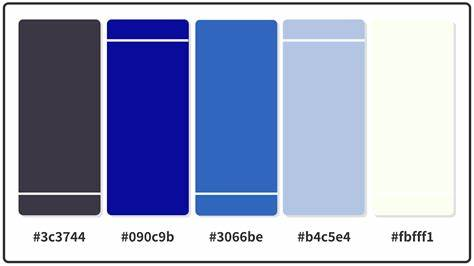

    
  
  # **Title**
  Java Cuisine
   

  ## **DESCRIPTION**
Java Cuisine is basically like "Goodreads," where you can search for restaurants. It shows you their locations and food, allowing you to read reviews from people who have already tried and reviewed those places.
  COLOR PALETTE            |  DEMO
:-------------------------:|:-------------------------:
   |   

## **KEY FEATURES:**
We have created a digital restaurant database, empowering users to effortlessly search and explore their favorite dining spots. Not only does our platform facilitate easy access to desired restaurants, but it also provides comprehensive reviews for each establishment, allowing users to make informed decisions about their dining experiences.

## **HOW TO USE Java Cuisine **

1. Install [Intellij](www.jetbrains.com).

2. Install [PostgresSQL](https://youtu.be/BLH3s5eTL4Y?si=m5dpogA9pHW99a72).

3. go into Intllij and located "FILE" in the top left corner.

4. After clicking "FILE" click on "New".

5. After clicking on "New" look for something that says "Project from Version Control..." 

6. Click on "Project from Version Control..." then go back into github and put the code into the URL

7. In Intellij look at the far right and locate the icon that says "Database" it should look like 3 circles stacking on top of each other.

8. Change the resource file to your own user, reviews and resturants. 

9. Add all of your desired information then hit icon that says RUN, it should look like a "play button".

## **LICENSE**
N/A